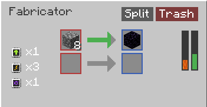

# Poly Factory

  

  
  

Poly Factory is a Minecraft mod for NeoForge. It adds a single machine block, the Fabricator, along with a set of items used to upgrade it.

## What the Fabricator does

The Fabricator is a block that processes items using stored Forge Energy (FE). It has one or more pairs of input and output slots. Place an item in an input slot by hand through the block menu, or feed it in automatically with pipes or another item transport mod, and the Fabricator will spend stored FE over time to process it. When processing finishes, the result appears in the matching output slot.

Each input and output pair has its own progress arrow in the block menu. The arrow fills in while that pair is processing, and turns fully red if it cannot continue, for example because its output slot is already full or holds an item the result cannot stack with.

## Upgrades

The Fabricator accepts three kinds of upgrade item, each of which can be applied up to level 3.

  
  
  

* Speed Upgrade. Reduces the time each processing cycle takes.
* Energy Upgrade. Increases how much FE the Fabricator can store and how fast it can accept FE.
* Slot Upgrade. Unlocks an additional input and output pair, called a lane, so the Fabricator can process more than one item at once.

Once more than one lane is unlocked, the block menu includes a Split toggle. Turning it on tells the Fabricator to automatically spread anything placed in an input slot evenly across every unlocked lane, instead of filling one lane before using the rest.

## Status

Poly Factory is currently a work in progress. Blocks, items, textures, and balance are all expected to change as development continues.

## Specifications

* Minecraft version: 26.1.2
* NeoForge version: 26.1.2.75
* Mod version: 1.0.0
* Java version: 25
* License: All Rights Reserved
